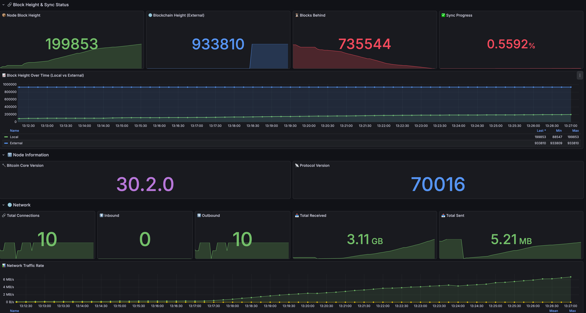

# Bitcoin Node with Monitoring Stack

Bitcoin Core full node with Prometheus metrics exporter and Grafana dashboard.



## Components

| Service | Version | Port | Description |
|---------|---------|------|-------------|
| Bitcoin Core | 30.2 | 8332 (RPC), 8333 (P2P) | Full node |
| Bitcoin Exporter | - | 9332 | Prometheus metrics exporter |
| Prometheus | v3.5.1 | 9090 | Metrics collection |
| Grafana | 12.3.1 | 3000 | Visualization |

## Quick Start

```bash
# Create data directory
mkdir -p data

# Start all services
docker-compose up -d

# Check status
docker-compose ps
```

## Access

- **Grafana**: http://localhost:3000 (admin/admin)
- **Prometheus**: http://localhost:9090
- **Bitcoin RPC**: http://localhost:8332

## Metrics

### Block Height & Sync

| Metric | Description |
|--------|-------------|
| `bitcoin_block_height` | Current block height on node |
| `bitcoin_external_block_height` | Current block height from blockchain.info |
| `bitcoin_sync_lag` | Blocks behind (external - local) |
| `bitcoin_verification_progress` | Sync progress (0-1) |

### Version Info

| Metric | Description |
|--------|-------------|
| `bitcoin_version` | Bitcoin Core version (e.g., 300200 = 30.2.0) |
| `bitcoin_protocol_version` | Protocol version (e.g., 70016) |

### Network

| Metric | Description |
|--------|-------------|
| `bitcoin_connections_total` | Total peer connections |
| `bitcoin_connections_in` | Inbound connections |
| `bitcoin_connections_out` | Outbound connections |
| `bitcoin_network_bytes_recv_total` | Total bytes received |
| `bitcoin_network_bytes_sent_total` | Total bytes sent |

### Mempool

| Metric | Description |
|--------|-------------|
| `bitcoin_mempool_size` | Number of transactions |
| `bitcoin_mempool_bytes` | Size in bytes |
| `bitcoin_mempool_usage` | Memory usage |
| `bitcoin_mempool_min_fee` | Minimum fee rate |

### Chain

| Metric | Description |
|--------|-------------|
| `bitcoin_difficulty` | Current mining difficulty |
| `bitcoin_chain_size_bytes` | Blockchain size on disk |
| `bitcoin_chain_work` | Total chain work (log2) |

## Grafana Dashboard

Dashboard is auto-provisioned and available at:
`Dashboards → Bitcoin → Bitcoin Node Dashboard`

### Sections:
1. **Block Height & Sync Status** - Node vs blockchain height comparison
2. **Node Information** - Bitcoin Core version, protocol version
3. **Network** - Connections, traffic rate
4. **Mempool** - Transaction pool statistics
5. **Mining & Chain** - Difficulty, chain size
6. **Errors & Health** - RPC error tracking

## Configuration

### Bitcoin Node

Edit `bitcoin.conf` to customize node settings:

```ini
# RPC credentials
rpcauth=admin:<hashed_password>

# Data directory
datadir=/opt/bitcoind/data

# Enable transaction index
txindex=1
```

### Generate RPC Auth

```bash
python3 rpcauth.py <username> <password>
```

## Architecture

```
┌─────────────────┐     ┌──────────────────┐      ┌─────────────┐
│   Bitcoin Node  │────▶│  Bitcoin Exporter │────▶│  Prometheus │
│    (bitcoind)   │ RPC │     (Python)      │     │   (v3.5.1)  │
└─────────────────┘     └──────────────────┘      └──────┬──────┘
                                                        │
                                                        ▼
                                                 ┌─────────────┐
                                                 │   Grafana   │
                                                 │  (12.3.1)   │
                                                 └─────────────┘
```

## Ports

| Port | Service | Protocol |
|------|---------|----------|
| 8332 | Bitcoin RPC | HTTP |
| 8333 | Bitcoin P2P | TCP |
| 28332 | ZMQ Block | TCP |
| 28333 | ZMQ TX | TCP |
| 9090 | Prometheus | HTTP |
| 9332 | Exporter | HTTP |
| 3000 | Grafana | HTTP |

## Troubleshooting

### Check logs

```bash
# Bitcoin node
docker logs bitcoin-mainnet

# Exporter
docker logs bitcoin-exporter

# All services
docker-compose logs -f
```

### Verify metrics

```bash
# Check exporter
curl http://localhost:9090/api/v1/query?query=bitcoin_block_height

# Check Prometheus targets
curl http://localhost:9090/api/v1/targets
```

### Restart services

```bash
docker-compose restart
```

## License

MIT
